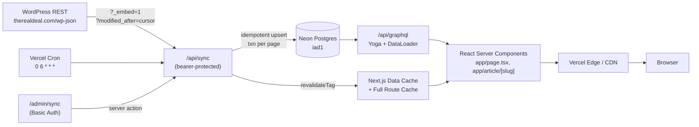

# TRD Lite

[](https://github.com/ChinmayShringi/TRD-Lite/actions/workflows/ci.yml)
[](https://trd-lite-takehome.vercel.app)

## 1. Overview

This is my take-home submission for The Real Deal. I built a small news site that mirrors articles from TRD's WordPress REST endpoint, stores them in Postgres, exposes them through my own GraphQL API, and renders them with Next.js. Production currently mirrors 509 posts.

I wrote this README in first-person because I want the reviewer to see how I think about the tradeoffs, not just what got shipped. The headline pieces:

- **Live:** <https://trd-lite-takehome.vercel.app>
- **Stack:** Next.js 15 (App Router), GraphQL Yoga with hand-written SDL, DataLoader, Drizzle, Neon Postgres.
- **Sync:** Vercel Cron at `0 6 * * *` calls a protected `/api/sync` route; a Basic-Auth-protected `/admin/sync` page can force a sync on demand.
- **Cache:** Postgres is the durable cache for WordPress content; the Next.js Data Cache with tag-based revalidation is the presentation cache on top.
- **Demo entrypoints:** `/sync-status`, `/api/graphql`, `/search?q=manhattan`, `/api/healthz`.

A quick map of where each piece of the brief lives:

- **Fetch content from the WordPress API.** Typed client at `src/lib/wp-client.ts` wraps `https://therealdeal.com/wp-json/wp/v2/posts`. It passes `?_embed=1` so author, media, and term data come back in one round trip, paginates with `?modified_after` for incremental pulls, and uses exponential backoff on 5xx responses. The sync orchestrator at `src/lib/sync.ts` is the only thing in the codebase that calls WordPress. User requests never touch it.
- **Store/cache the data locally in a database.** Neon Postgres. Schema and migrations in `src/db/schema.ts` and `drizzle/`; tables I projected from WP: `posts`, `authors`, `media`, `terms`, `post_terms`, `sync_runs`. Each row keeps a `raw jsonb` column for the original WP payload so I can add columns later without re-syncing. The sync worker upserts idempotently in dependency order, one Drizzle transaction per 100-post page.
- **Expose the data through a GraphQL API.** GraphQL Yoga mounted at `/api/graphql`. Hand-written SDL in `src/graphql/schema.ts`. Resolvers are thin wrappers over Drizzle relational queries, with a per-request DataLoader context as a fallback for chatty resolvers. Operations: `posts`, `post`, `postsByTerm`, `searchPosts`, `syncStatus`. Cursor pagination is base64-encoded `publishedAt|id`. GraphiQL is on in development.
- **Use that GraphQL API to power the frontend.** Every page in `app/` fetches through `src/lib/graphql-fetch.ts`, which calls `/api/graphql` with `next: { tags, revalidate }`. I added a guard that prevents `app/` and `src/components/` from importing anything under `src/db/`, so the frontend cannot bypass the GraphQL layer. No Apollo Client or urql in the bundle; React Server Components do the fetching server-side.
- **Homepage with at least 5 articles.** `app/page.tsx` renders a hero plus a 12-card grid, then keeps appending older stories on scroll using cursor-based pagination from the same GraphQL field.
- **Basic article page.** `app/article/[slug]/page.tsx` is a semantic `<article>` with header, headline, byline, `<time datetime>`, featured image, sanitized body HTML, and related stories from the same primary sector. A small "Listen" control reads the article aloud through the Web Speech API.
- **README with architecture, tradeoffs, caching, AI usage.** Architecture in section 4, data model in section 5, caching and sync in section 6, tradeoffs in section 11, AI tooling in section 12.

## Table of contents

1. [Overview](#1-overview)
2. [Live Demo and Repository](#2-live-demo-and-repository)
3. [Quick Start](#3-quick-start)
4. [Architecture](#4-architecture)
5. [Data Model](#5-data-model)
6. [Caching and Data Syncing](#6-caching-and-data-syncing)
7. [GraphQL API](#7-graphql-api)
8. [Frontend Decisions](#8-frontend-decisions)
9. [Performance, Security, Accessibility, and SEO](#9-performance-security-accessibility-and-seo)
10. [Testing and CI/CD](#10-testing-and-cicd)
11. [Tradeoffs and Decisions](#11-tradeoffs-and-decisions)
12. [AI Tooling](#12-ai-tooling)
13. [What I Would Do Next](#13-what-i-would-do-next)
14. [License and Content Attribution](#14-license-and-content-attribution)

## 2. Live Demo and Repository

- **Live URL:** <https://trd-lite-takehome.vercel.app>
- **GitHub:** <https://github.com/ChinmayShringi/TRD-Lite>
- **Vercel project:** `prj_U3TwFCMFgZRa5vR3hIZCv9HpWzKx` under `fakeairhead-3730s-projects`
- **GraphiQL (dev only):** `http://localhost:3000/api/graphql`
- **Public sync status:** <https://trd-lite-takehome.vercel.app/sync-status>

## 3. Quick Start

```bash
git clone git@github.com:ChinmayShringi/TRD-Lite.git
cd TRD-Lite
pnpm install

# Either pull env from a linked Vercel project (with Neon Marketplace integration):
vercel link && vercel env pull .env.local
# Or copy the example and fill in your own DATABASE_URL (Neon free tier at neon.tech),
# SYNC_TOKEN (any 32-byte hex), ADMIN_USER, ADMIN_PASS:
# cp .env.example .env.local

pnpm db:migrate                    # apply Drizzle migrations to Neon
pnpm tsx --env-file=.env.local scripts/backfill.ts   # seed ~500 posts from TRD's WP API
pnpm dev                           # http://localhost:3000
```

Tests: `pnpm test` (Vitest unit + integration), `pnpm test:e2e` (Playwright + axe-core).

## 4. Architecture

### Data flow



A daily Vercel Cron hits the bearer-protected `/api/sync` route. The handler reads `max(posts.modified_at) - 60s` as a cursor, pages through `wp/v2/posts?_embed=1&modified_after=...`, and idempotently upserts media, authors, terms, posts, and post_terms in that order. After upserts it calls `revalidateTag` for `homepage`, `post:{slug}`, and `sector:{slug}`. Server Components fetch from `/api/graphql` over plain `fetch` with `next: { tags, revalidate: 300 }`.

### Why a single Next.js app

I kept the GraphQL layer and the Next.js frontend in one repo and one deploy. The tradeoff: this is simpler to run and review for a take-home, but it does mean the API and frontend share a process and a release cadence. To make the future split easy, I folder-isolated the GraphQL code under `src/graphql/` and forbade frontend code from importing `src/db/` directly. Lifting `src/graphql/` into a separate Hono service later would be a few hours of work instead of a rewrite.

### Why GraphQL Yoga

I picked GraphQL Yoga over Apollo Server because Yoga is a thin handler that drops into a Next.js route. I also chose a hand-written SDL with `makeExecutableSchema` instead of a code-first builder like Pothos. The Pothos Drizzle plugin was in beta when I started, and for a take-home I preferred a setup the reviewer can read top-to-bottom without learning a builder DSL. I add type safety on top with `graphql-codegen` and a `codegen:check` step in CI.

### Why Postgres as the durable cache

The brief said "store/cache the WordPress data however you think makes sense." I chose Postgres because it gives me transactional writes, indexes for the homepage and slug lookups, and a clean place to keep an operational log (`sync_runs`). My goal was to avoid calling WordPress during user requests while still keeping the frontend backed by real synced content. SQLite would have worked locally but does not fit the Vercel-plus-managed-DB deploy story, and an in-memory cache would not survive a function cold start.

## 5. Data Model

### Posts

`posts` holds the editorial entity: WP `id` (bigint), `slug`, `title`, `excerpt`, `excerpt_html`, `content_html` (already sanitized at sync time), `link` (the canonical TRD URL), `status`, `published_at`, `modified_at`, `author_id`, `featured_media_id`, and a `raw jsonb` column. Indexes on `published_at`, `(status, published_at)`, and `slug` cover the homepage, status filtering, and slug lookups.

### Authors

`authors` keeps `id`, `slug`, `name`, `description`, avatar URLs, and `raw jsonb`. Articles join via `posts.author_id`.

### Media

`media` carries `id`, `source_url`, `mime_type`, `alt_text`, `width`, `height`, and the `media_details.sizes` map preserved as JSON so the frontend can pick the right crop. `posts.featured_media_id` points here.

### Terms and taxonomies

WP has multiple taxonomies (`category`, `sector`, `market`, `tag`). I normalized this into a single `terms` table with `taxonomy`, `slug`, `name`, and a unique constraint on `(taxonomy, slug)`. `post_terms` is the join table with indexes on both sides so `postsByTerm` is index-supported in both directions.

### Sync runs

`sync_runs` is the operational log: `started_at`, `finished_at`, `modified_after`, `posts_upserted`, `errors`, `status`, `notes`. `/sync-status` reads the most recent rows.

### Why raw JSONB is stored

ACF and Yoast field shapes drift across WordPress versions, and I did not want to re-sync hundreds of posts if I later decided to expose a new field. Keeping `raw jsonb` adds maybe 8 to 10 KB per row, which is trivial at this scale, and gives me a recovery path if I miss a column.

## 6. Caching and Data Syncing

### Postgres as the durable WordPress cache

The brief asked for the WordPress data to be stored or cached locally. I chose Postgres as the durable layer. The sync worker is the only process that ever touches WordPress; user requests read from Postgres through the GraphQL resolver. This isolates the app from WordPress latency and from temporary WordPress outages, and it gives me indexed reads instead of REST calls.

### Next.js Data Cache and tag invalidation

On top of Postgres I use the Next.js Data Cache as a presentation cache. Every server-component GraphQL call uses `fetch('/api/graphql', { next: { tags, revalidate: 60..300 } })`, so warm requests inside the revalidate window skip the resolver and the DB. After every successful sync, the handler calls `revalidateTag('homepage')`, `revalidateTag('post:{slug}')` for each updated post, and `revalidateTag('sector:{slug}')` for each affected sector. The browser may cache prefetched route payloads, but freshness does not depend on the browser at all.

```
WordPress REST API
  |  touched ONLY by the sync worker on a cron schedule
  v
Sync worker (lib/sync.ts)
  |  pulls with ?modified_after cursor, sanitizes HTML on write
  v
Neon Postgres          <-- the durable server-side cache
  |  every user request reads from here, never from WordPress
  v
GraphQL resolver layer (Drizzle relational queries + per-request DataLoader)
  v
Next.js Data Cache     <-- the presentation cache on top of Postgres
  |  fetch('/api/graphql', { next: { tags, revalidate: 60..300 } })
  |  revalidateTag(tag) invalidates these on writes from /api/sync
  v
Next.js Full Route Cache + Vercel CDN
  |  static generation for /, /sector/[slug], /article/[slug]; 300s safety net
  v
Browser
  |  prefetched <Link> targets and standard HTTP asset cache
  |  not responsible for content freshness
```

### Revalidation strategy

| Tag | Used by | Invalidated when |
| --- | --- | --- |
| `homepage` | `/` | Any post in the homepage window changes |
| `post:{slug}` | `/article/{slug}` | That specific post changes |
| `sector:{slug}` | `/sector/{slug}` | Any post in that sector changes |
| `market:{slug}` | (reserved for `/market/{slug}`) | Any post in that market changes |

The 300-second time-based revalidate is a safety net in case a tag-based invalidation is ever missed (for example when the standalone backfill script runs outside a Next request context).

### Why user requests never hit WordPress directly

Two reasons. First, latency and availability: if the frontend called WordPress on every request, a slow or down upstream would take this site down too. Second, the brief explicitly asked for the WP data to be stored or cached locally, and pulling on every request would not satisfy that.

### Why no Redis

I considered Redis and chose not to add it. Postgres with proper indexes returns the homepage query in single-digit milliseconds, and the Next.js Data Cache fronts that. For this scope, Redis would be a fourth tier with no observable benefit and one more failure mode to operate. On a larger system with higher traffic or more cross-request state (rate limits, session stores, real-time fanout), I would revisit.

### How sync works in detail

`src/lib/sync.ts` owns the pipeline; `app/api/sync/route.ts` is the bearer-protected HTTP handler.

- **Cursor.** `max(posts.modified_at)` minus a 60-second safety overlap. The overlap is safe because every entity is `INSERT ... ON CONFLICT DO UPDATE`.
- **Pagination.** `?_embed=1&per_page=100&orderby=modified&order=asc&modified_after={cursor}`, with a 1-second delay between pages and exponential backoff on 5xx.
- **Upsert order.** Media, authors, terms, posts, post_terms. Foreign keys are satisfied at every step.
- **Transaction per page.** Each 100-post page is wrapped in a Drizzle transaction over the Neon WebSocket driver. If a page fails, the cursor does not advance.
- **Sanitization on write.** `src/lib/sanitize.ts` runs `sanitize-html` with an editorial allowlist before content lands in the DB. I pay the CPU cost once per post, not per view, and the DB never holds unsafe HTML.
- **Operational log.** Every run writes a row to `sync_runs`. `/sync-status` reads the most recent ones.

One thing I did not solve in v1: deletes are invisible to a `modified_after` sweep because the WP endpoint just stops returning the row. I called this out in section 14.

## 7. GraphQL API

### Schema overview

```graphql
type Query {
  posts(first: Int, after: String, status: PostStatus = PUBLISHED): PostConnection!
  post(slug: String!): Post
  postsByTerm(taxonomy: Taxonomy!, slug: String!, first: Int, after: String): PostConnection!
  searchPosts(query: String!, first: Int = 10, after: String): PostConnection!
  syncStatus: SyncStatus!
}
```

`Post` carries the title, excerpt, sanitized HTML body, publish/modify dates, the canonical TRD `link`, author, featured media, and the joined `sectors` and `tags`.

### Example queries

```graphql
# Homepage
query Latest {
  posts(first: 12) {
    edges {
      cursor
      node { id slug title excerpt publishedAt sectors { slug name } featuredMedia { url width height alt } }
    }
    pageInfo { hasNextPage endCursor }
  }
}

# Article page
query Article($slug: String!) {
  post(slug: $slug) {
    id slug title excerpt contentHtml publishedAt modifiedAt link
    author { name slug avatarUrl }
    featuredMedia { url width height alt }
    sectors { slug name }
  }
}
```

### Cursor pagination

Cursors are base64-encoded `publishedAt|id` strings. I picked this shape because it is stable across sorts, does not leak primary keys, and is easy to debug (a base64 decode shows the boundary). The encode/decode helpers live in `src/graphql/cursor.ts` and are covered by a round-trip unit test.

### N+1 prevention

The naive shape would be `posts -> 10 author queries -> 10 media queries -> 30 term queries = 51 SQL`. I used Drizzle's relational query API so the homepage plans as a single statement:

```ts
db.query.posts.findMany({
  with: { author: true, featuredMedia: true, terms: { with: { term: true } } },
});
```

Measured with Drizzle's `logger: true` flag and recorded in [`docs/measurements/query-counts.md`](docs/measurements/query-counts.md):

| GraphQL operation | SQL statements |
| --- | --- |
| `posts(first: 10)` | 1 |
| `post(slug: $slug)` | 1 |
| `postsByTerm(taxonomy, slug, first: 10)` | 2 |

`postsByTerm` issues two statements (a taxonomy allowlist plus the main relational query) because keeping the relational hydration intact requires a top-level table-only `findMany`. I left DataLoader factories in the per-request context as a fallback so any future resolver that bypasses the relational query still gets batching.

## 8. Frontend Decisions

### Homepage

`app/page.tsx` shows a hero card and a 12-card grid. I added infinite scroll using `IntersectionObserver` and the same cursor pagination from GraphQL because it matches how a reader of an editorial site actually scans. Skeletons hold the grid layout during the fetch so the page never jumps.

### Article page

`app/article/[slug]/page.tsx` is a single `<article>` with semantic header, headline, byline, time, featured image, sanitized body HTML, and a related-stories rail from the same primary sector. I added a small "Listen" button using the Web Speech API. It is browser-native, free, and on-device; if the device exposes no natural-sounding US English voice, the control hides itself instead of falling back to the robotic platform default. In production I would swap this for an ElevenLabs voice (or a fine-tuned house voice) and cache the MP3 in Vercel Blob keyed by `slug + content_hash`.

### Search

`app/search/page.tsx` is backed by Postgres full-text search. I added a `tsvector` column generated from title plus excerpt plus content HTML, a GIN index over it, and a `searchPosts` GraphQL field that uses `to_tsquery` with a `plainto_tsquery` fallback and `ts_rank` ordering. The page debounces input, highlights matching tokens, and shows a result count chip.

### Sync status page

`/sync-status` is a public read-only view of the last 20 sync runs (status, posts upserted, started/finished timestamps, errors). I included it because the simplest way for a reviewer to confirm the system is alive is one click. `/admin/sync` is the Basic-Auth-protected force-sync UI for ad-hoc refresh.

### Editorial design direction

I constrained the visual system with `.impeccable.md` so the UI did not drift into generic SaaS aesthetics. The references I aimed at are WSJ, NYT, and FT; the anti-references are TRD's red sans-serif brand, gradient marketing pages, and crypto-dashboard glassmorphism. I used Source Serif 4 for headlines, Inter for UI, and a calm blue accent (`oklch(0.55 0.20 245)`) used only on interactive surfaces. Light and dark are both first-class; a pre-hydration script applies the saved preference before paint to avoid theme flash.

## 9. Performance, Security, Accessibility, and SEO

### Performance

- Postgres plus Next.js Data Cache covers warm requests without a resolver hit.
- The Neon project is colocated with Vercel's `iad1` region; this dropped my measured query latency from roughly 70 ms cross-region to roughly 3 ms intra-region.
- I size images via `width` and `height` from `media_details` and pass them to `next/image`, which prevents layout shift.
- I prefer skeletons over spinners for anything over ~150 ms so the layout never collapses.

### HTML sanitization

I sanitize CMS HTML at sync time, not at render time, with an editorial allowlist (`img`, `figure`, `figcaption`, `iframe` restricted to YouTube hosts, `section`, common inline tags). `<a>` is rewritten to add `rel="noopener noreferrer"`. The DB never holds unsafe HTML, even briefly, and render-time is just an injection of the already-trusted column.

### Protected sync endpoint

`/api/sync` requires `Authorization: Bearer ${SYNC_TOKEN}`. Vercel Cron supplies it automatically. The `/admin/sync` UI is gated by HTTP Basic Auth in `middleware.ts`; the force-sync form posts to a server action that re-reads `SYNC_TOKEN` server-side and calls `/api/sync` from inside the same Vercel function. The token never reaches the browser, and a Playwright assertion verifies that by inspecting the rendered HTML.

I also set Content-Security-Policy, `Referrer-Policy`, `X-Content-Type-Options`, and `X-Frame-Options` globally in `next.config.ts`. The current CSP is intentionally permissive on `script-src` and `style-src` because of inline JSON-LD and Tailwind's runtime styles; I noted a per-request nonce upgrade in section 14.

### Accessibility checks

- Semantic HTML throughout (`<article>`, `<header>`, `<time datetime>`, one `<h1>` per page).
- Real `<button>` and `<a>` elements, with `focus-visible:ring-2 focus-visible:ring-offset-2` defaults.
- Every `next/image` carries an `alt` value from `_embedded["wp:featuredmedia"].alt_text`.
- `axe-core` runs in CI through Playwright on `/` and one article page; the assertion is zero `serious` or `critical` violations. Result on production: clean.
- I would not claim full WCAG 2.1 AA without a manual review, but I treated AA as the target and the automated assertion as the floor.

### SEO and canonical URLs

- `generateMetadata` on every page emits OpenGraph, Twitter, and `alternates.canonical` pointing back to the original TRD URL stored in `posts.link`. The canonical points back deliberately, because this is a demo and TRD is the source of truth.
- `JSON-LD NewsArticle` ships in the article `<head>`. The serializer escapes `<` to `<` to neutralize a closing-tag injection vector.
- `sitemap.xml` is generated from the `posts` table.
- `robots.txt` sets `noindex` for the demo so it cannot be mistaken for the source.

## 10. Testing and CI/CD

### Unit tests

I prioritized the security-critical and correctness-critical paths first: sanitize allowlist invariants, cursor encode/decode round-trip, sync idempotency, cursor advancement, bearer-token rejection, cache-tag generation, and the frontend boundary rule (no `@/db` imports outside `src/graphql/`).

### Integration tests

Vitest also covers the GraphQL surface against a test database: `post(slug)`, `posts` pagination, status filter behavior, FTS rank ordering and empty-query short-circuit, codegen drift detection, sync-UI auth path, and a Postgres connection smoke check. The full Vitest suite is 40 tests.

### Playwright and axe-core

I added 5 Playwright tests: homepage a11y, article-page a11y, public `/sync-status`, the `/admin/sync` 401 challenge with a `WWW-Authenticate` header, and the SYNC_TOKEN leak assertion against rendered HTML.

```bash
pnpm test         # 40 vitest tests
pnpm test:e2e     # 5 Playwright tests
pnpm coverage     # vitest with V8 coverage
```

### GitHub Actions

CI runs on every push to `main` and every PR. Three jobs:

1. **`static`** runs lint, typecheck, the codegen drift check, and the build.
2. **`test`** runs the Vitest suite. It depends on `static`.
3. **`e2e`** runs Playwright plus axe-core. It depends on `static` and uploads `playwright-report/` on failure with a 7-day retention.

I gated `test` and `e2e` on `needs: [static]` so they do not race past obvious type errors.

### Vercel deployment

Vercel's GitHub integration auto-deploys `main` to production once CI is green; preview URLs are wired up on PRs. The project is on the Hobby tier, which caps cron at one execution per day, so my schedule is `0 6 * * *`. On a Pro upgrade I would switch to `*/5 * * * *`; the rest of the cron handler does not change.

## 11. Tradeoffs and Decisions

### Single app vs separate backend

I shipped one Next.js app instead of splitting the GraphQL layer into its own service. The tradeoff is that the API and the frontend share a deploy cadence, and any frontend-only change re-deploys the API too. I accepted that for a take-home and folder-isolated `src/graphql/` so the future split is cheap.

### Drizzle vs Prisma

I chose Drizzle because it works cleanly with Neon's HTTP and WebSocket drivers and ships small, type-safe relational queries without a separate query engine binary. Prisma is more widely recognized and would have been a defensible alternative; the migration paths in either direction are short.

### Hand-written SDL vs Pothos

I picked hand-written SDL because the schema is small, the resolvers are thin, and the reviewer can read the whole API in two files. Pothos with its Drizzle plugin would have generated some of this for me, but it was in beta when I started, and for a take-home I preferred a setup that is easy to audit over one that is clever.

### Server Components + fetch vs Apollo Client

I used React Server Components with plain `fetch` against `/api/graphql` so the browser never loads a GraphQL client. The tradeoff is that I lose Apollo's normalized cache and optimistic updates; for a read-mostly news site that is a fair price, and the bundle is roughly 100 KB smaller.

### Cron sync vs request-time WordPress fetch

I chose cron-driven sync over pulling from WordPress on every request. Request-time pulls would amplify any WP outage and would also break the assignment's "store/cache the WordPress data locally" requirement. The tradeoff is freshness: on Hobby, my cron is daily; on Pro it would be every 5 minutes; with a WP webhook plugin it would be near real-time.

### Vercel Hobby vs Pro

I deployed on Hobby and was honest about the constraint in the deployment section. Cron is daily, and ad-hoc refresh goes through the protected `/api/sync` endpoint or the `/admin/sync` UI. The system works the same either way; only the schedule differs.

### What was intentionally cut

- **Site-wide auth.** A public news mirror does not need user accounts.
- **Mutations.** This is a read-only mirror by design; every write goes through the sync worker.
- **Comments.** No source data and no value in fabricating one.
- **A custom design system.** I used Tailwind with the minimum custom components needed.
- **Redis.** Section 7 covers why.
- **A query-count debug header.** I record real measurements in `docs/measurements/query-counts.md` instead.

## 12. AI Tooling

I included this section because the assignment allowed AI tools and the role description values AI-assisted development. I want to be specific about how I used it.

### Human-led architecture

I treated AI as an execution and verification system around a human-led design. The architecture, caching model, GraphQL boundary, sync semantics, schema shape, and product tradeoffs in this README are my decisions. Claude Code accelerated the implementation, verification, and documentation work around those decisions; it did not pick them for me.

### Claude Code implementation workflow

I drove Claude Code from a written project plan (`plan.md`) with acceptance criteria, verification commands, and architectural constraints. Each phase had to pass `typecheck`, the relevant test suite, and the build before the next phase started. The full execution trace is in [`docs/orchestration/orchestration-plan.md`](docs/orchestration/orchestration-plan.md), and the `git log --oneline` reads as the wave history.

### Three-agent implementer/auditor/documenter pattern

For each phase I used three roles:

- **Implementer:** translated the plan into code.
- **Auditor:** reviewed the implementation against the brief, checked edge cases, added tests where they were missing, and forced verification through `typecheck`, `test`, `build`, and Playwright runs.
- **Documenter:** updated the README, recorded tradeoffs, and committed with a Conventional Commit message.

The pattern was useful because the auditor surfaced real issues during the build, including a Next 16 vs 15 mismatch, draft posts leaking through `post(slug)` before I added a status filter, `'unsafe-eval'` accidentally being included in the production CSP, a JSON-LD `<`-escape gap, a Playwright env loader issue that was silently skipping a security test, and a sector-chip contrast that axe flagged at 4.12:1. Each was fixed inside the same phase.

### Persistent project memory

I maintained an external Obsidian-based knowledge vault outside the repo for planning notes, design references, architecture decisions, and tradeoffs. Indexing it with semantic embeddings let me retrieve prior decisions by meaning rather than filename, so context did not reset between Claude Code sessions. This was mostly a productivity choice; it kept me from re-explaining decisions to a fresh session.

### Design constraints and review process

I did not let the model pick the visual system. I wrote `.impeccable.md` with explicit references (WSJ, NYT, FT) and explicit anti-references (TRD's red branding, generic SaaS landing-page aesthetics, crypto-dashboard glassmorphism), and I checked UI changes against that brief. The goal was a result that read as editorial, not as an AI-styled prototype.

The honest summary: I used Claude Code as a force multiplier on a human-owned design, with verification at every step. The architecture and tradeoffs in this README are explicit so a reviewer can see what was delegated and what was not.

## 13. What I Would Do Next

- **Webhook-based invalidation.** Requires a WP plugin (e.g., WP Webhooks) that I cannot install on TRD's production CMS. On a CMS I control, this is the upgrade from 5-minute or daily lag to near-real-time. The cron handler shape does not change; only the trigger does.
- **Other custom post types.** TRD has `magazine`, `events`, `dataset`, `sponsored`, `press-releases`, and `advertiser` CPTs. Adding a `kind` discriminator to `posts` (or a generalized `content` table) would generalize the schema without a separate join table per CPT.
- **Per-request CSP nonces.** Drop `unsafe-inline` from `script-src` by emitting a per-request nonce in the root layout and applying it to the JSON-LD tag.
- **Delete detection.** A daily full-ID sweep that diffs `posts?per_page=100&fields=id` against the local `posts.id` set and soft-deletes the missing ones. The reason it is not in v1 is honesty about scope, not difficulty.
- **OpenTelemetry.** Pino is enough for one process; OTel would be the right move once there is more than one worker and a real dashboard target.
- **Production TTS.** Replace the Web Speech API "Listen" control with an ElevenLabs voice (or a fine-tuned house voice) and cache the MP3 in Vercel Blob keyed by `slug + content_hash`.

## 14. License and Content Attribution

MIT, see [`LICENSE`](./LICENSE). Authored as a take-home for The Real Deal. Article content is mirrored from therealdeal.com, and every article page links back to its canonical URL there.
